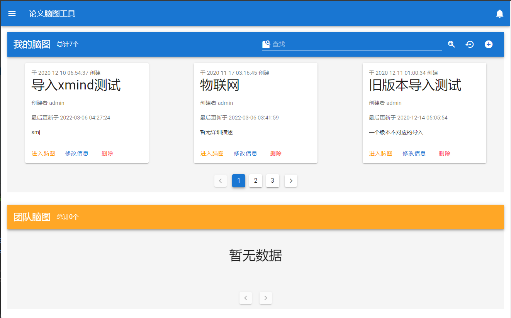
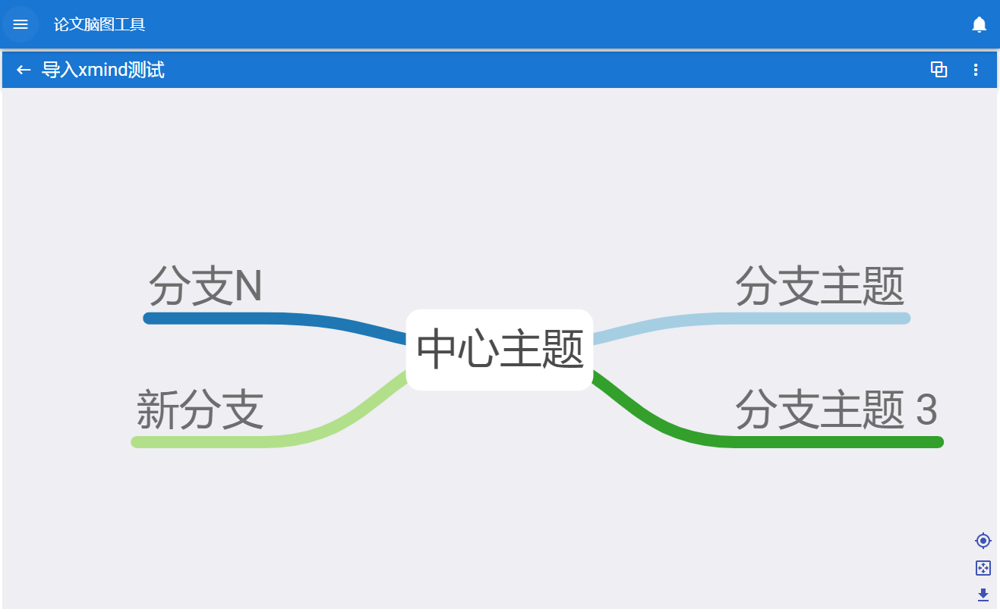
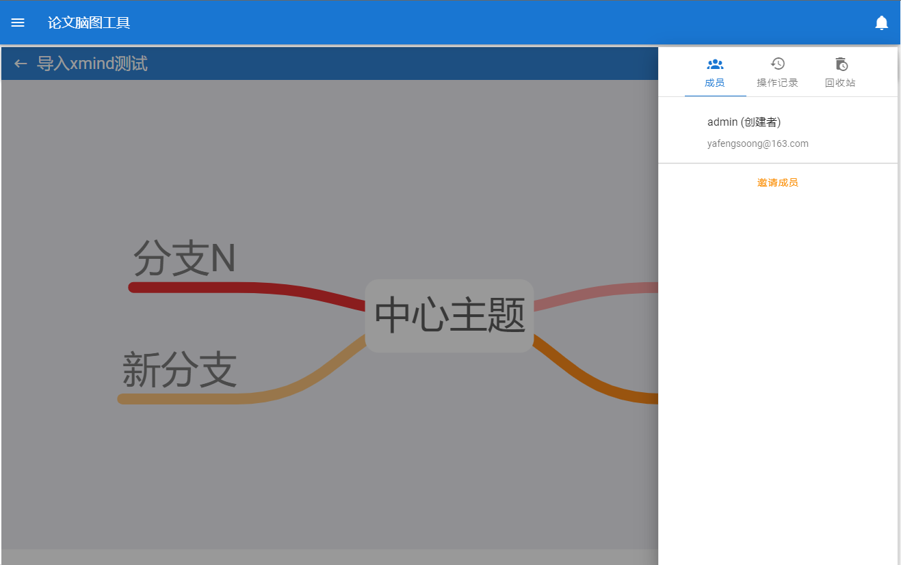

# 在线脑图工具

## 描述

使用Vue2.x搭建的脑图工具，脑图组件来自[hellowuxin/mindmap](https://github.com/hellowuxin/mindmap)
 后端使用SpringBoot搭建，仓库[地址](https://github.com/yafeng-Soong/mindmap-manager-backend)
 日后有时间会在博客出详细教程

## 主要界面展示

- 主页 

- 脑图页 

- 更多操做 
